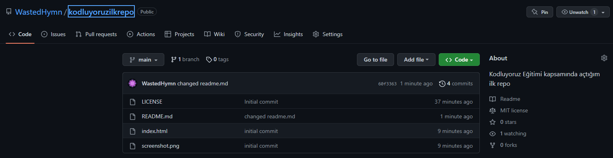

# kodluyoruzilkrepo

Bu repo [Kodluyoruz](kodluyoruz.org/) Front-End Eğitiminde oluşturduğumuz ilk repo. İçerisinde bir adet README dosyası, bir adet de index.html barındırıyor.

## Installation

[Öncelikle projeyi clonelayın.](https://github.com/WastedHymn/kodluyoruzilkrepo)

```
git clone https://github.com/WastedHymn/kodluyoruzilkrepo
```

## Usage

Projeyi cloneladıktan sonra Visual Studio Code programında açınız.
<br />
Linux için:

```
cd kodluyoruzilkrepo
code
```

## Contributing

Pull requestler kabul edilir. Büyük değişiklikler için, lütfen önce neyi değiştirmek istediğinizi tartışmak için bir konu açınız.

## Licence

[MIT](https://opensource.org/licenses/MIT)

## Screenshot


